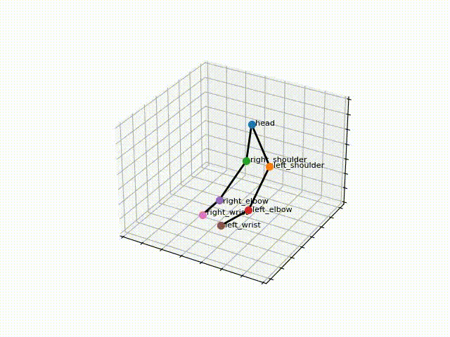

# Arms3D (in development)
Project for developing markerless arms motion capture and motion analysis.

## Input Data
Initially we have a synchronized stream of color images and depth maps received from the RGB-D camera.

 
     
     
      
     
    

## Output Skeleton
As a result, we get three-dimensional coordinates of key points of the hands.

    

